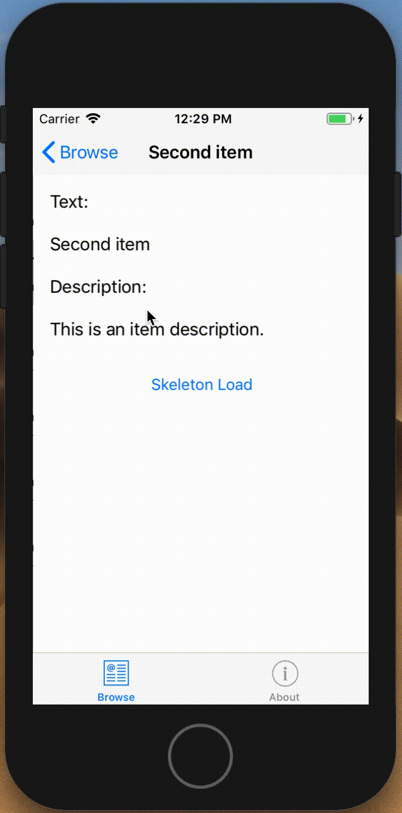

# SkeletonView
It is a portable library designed for Xamarin.Forms that aims to generate **skeleton animation** to the elements of the view.  It is very useful when loading data and shows the user that it is generating an action.

## Feedback

Please use [GitHub issues](https://github.com/roswer13/SkeletonView/issues) for questions or comments.

